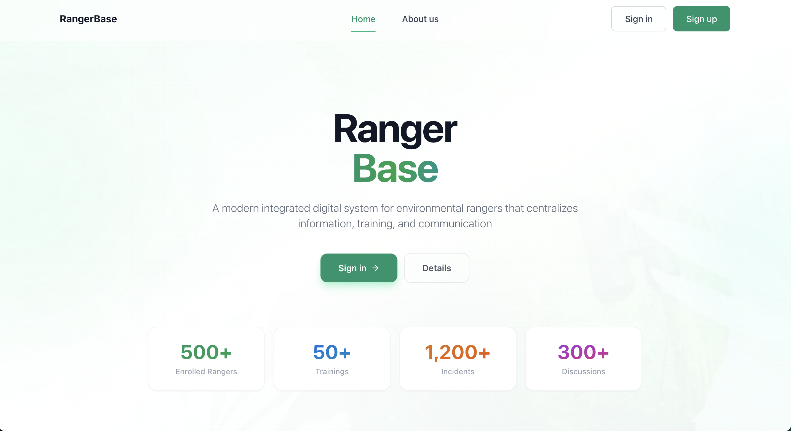
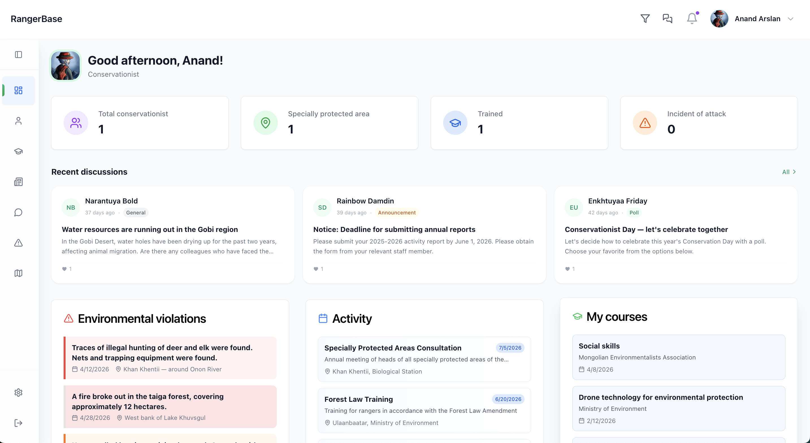
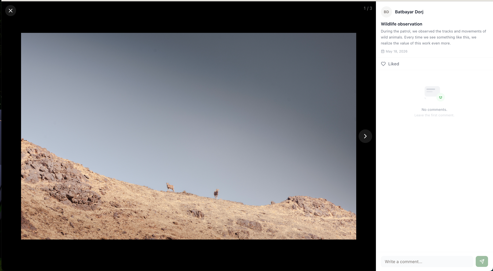
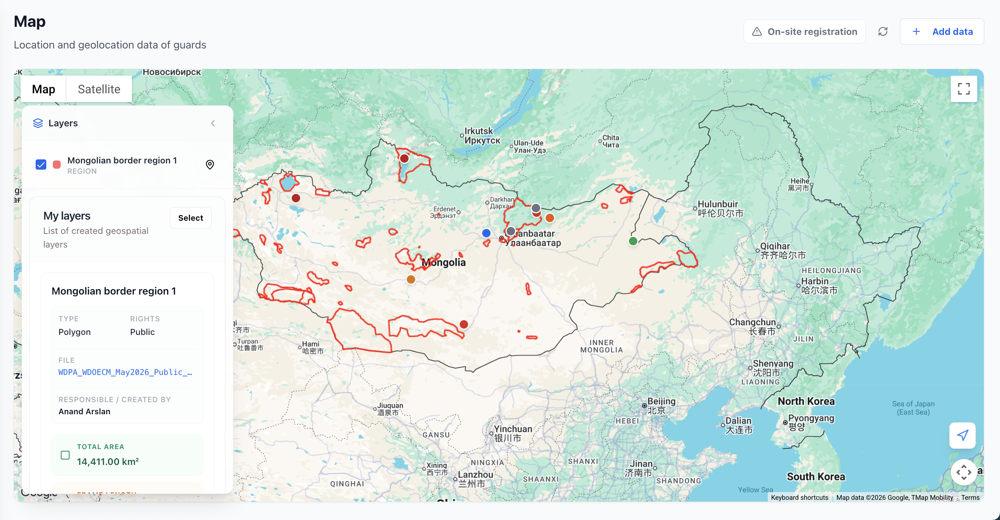

# RangerBase — Case Study

**A field-operations platform for environmental rangers in Mongolia.**
Incident reporting, training records, territory mapping, and a community feed —
in one system, usable from a desk or from a truck in the Gobi.

`Next.js 14` · `Laravel 13` · `PostgreSQL 16` · `Google Maps` · `React Native`

---

## The problem

Mongolia's protected areas are patrolled by rangers spread across enormous,
sparsely connected territory. The operational record of that work — who patrolled
where, what violations were found, who has been trained on what — lived in
spreadsheets, group chats, and paper.

That creates three concrete failures:

1. **Incidents go uncounted.** A poaching find reported in a group chat is not
   data. It can't be aggregated, mapped, or used to argue for budget.
2. **Territory is undefined.** Rangers know their patrol area; the organisation
   has no machine-readable boundary for it, so coverage gaps are invisible.
3. **Training is unauditable.** Certification status is the thing a regulator
   asks about, and it was the hardest thing to produce.

RangerBase exists to make each of those a queryable record.

---

## What it does

### Public landing



Single green accent, no gradient soup. The stat row is marketing copy on the
public page — the real numbers live behind auth and are per-organisation.

### Role-aware dashboard



The landing screen after sign-in. Everything here is scoped to the viewer's
role and protected area: a ranger sees their own area, staff see the area they
administer, admins see everything.

Four operational counters, then the three things a ranger actually opens the app
for — recent discussion, environmental violations logged nearby, and upcoming
activity and coursework.

### Discussions


Three post categories with different permissions: **General** is open to
everyone, **Announcement** and **Poll** are staff/admin only. Polls are backed by
a real survey-response store with one response per member per survey, and an
aggregation endpoint that returns per-option counts and percentages for staff.

### Field photo gallery



Rangers upload observations from patrol. Files are stored as opaque paths, not
public URLs, and re-signed on read — so a leaked image link expires rather than
staying live forever.

### Territory mapping



The piece that took the most work. Rangers upload a KML, KMZ or GeoJSON file
describing their patrol territory; the backend parses it into typed geometry
(points, polylines, polygons with holes), stores it, and computes metrics.

That **14,411.00 km²** is not from the source file — it's a spherical-excess
area calculation over the polygon ring, computed server-side and cached in layer
metadata alongside perimeter, centroid, and walking/driving traversal estimates.

Layers carry a visibility level (`private` / `protected_area` / `organization` /
`public`), and each ranger gets exactly one **territory** layer per protected
area, enforced by a partial unique index in the database rather than by
application logic.

---

## Architecture

```
┌─────────────────┐        ┌──────────────────┐        ┌──────────────┐
│   Next.js 14    │  JSON  │   Laravel 13     │  SQL   │ PostgreSQL   │
│   App Router    │───────▶│   REST API       │───────▶│      16      │
│   pages + map   │        │   118 routes     │        │   20 tables  │
└────────┬────────┘        └─────────┬────────┘        └──────────────┘
         │                           │
         │ Maps JS API               │ Bearer tokens
         ▼                           ▼
  Google Maps                  Mobile app
```

Next.js renders the pages and owns the map. Laravel owns every `/api/*` route
and all database access. The Mobile app talks to the same API.

## Stack

| Layer | Choice | Why |
|---|---|---|
| Frontend | Next.js 14 (App Router), TypeScript, Tailwind, shadcn/ui | Server components for the content pages, client components for the map |
| Mapping | Google Maps JS API via `@vis.gl/react-google-maps` | Satellite imagery coverage over Mongolia; KML layer support |
| Backend | Laravel 13, PHP 8.4 | Mature ecosystem, first-class Postgres support, straightforward hosting |
| Database | PostgreSQL 16 | Native enums, `jsonb` for geometry and survey payloads, partial indexes |
| Mobile | React native | Wraps the same frontend; shares the API via bearer tokens |
| Infra | Docker Compose (nginx + php-fpm + Next.js + Postgres) | One command to a working stack |

---

*Screenshots are from a seeded demo environment. Figures on the public landing
page are illustrative copy, not production usage.*
